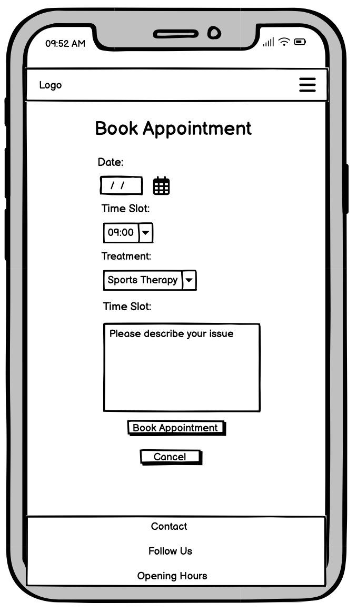

# PhysioApp


PhysioApp is a dedicated platform for individuals seeking personalized sports therapy and wellness solutions. Run by a sole practitioner, PhysioApp emphasizes a holistic approach to health, offering specialized services including sports therapy, orthotics, and health coaching. Whether you're aiming to enhance your athletic performance, recovering from an injury, or interested in improving your overall health, PhysioApp is here to provide tailored support and expert guidance.

Visit the deployed website [here](https://physioapp.onrender.com).

## Table of Contents

1. [User Experience (UX)](#user-experience-ux)
    1. [Strategy](#strategy)
        1. [Project Goals](#project-goals)
        2. [User Goals](#user-goals)
        3. [Strategy Table](#strategy-table)
    2. [Scope](#scope)
        1. [User Stories](#user-stories)
    3. [Structure](#structure)
    4. [Skeleton](#skeleton)
    5. [Surface](#surface)
2. [Features](#features)
    1. [General](#general)
    2. [Home Page](#home-page)
    3. [About Page](#about-page)
    4. [Service Offerings](#service-offerings)
    5. [Appointment Booking](#appointment-booking)
    6. [User Profile](#user-profile)
    7. [Authentication Pages](#authentication-pages)
3. [Technologies Used](#technologies-used)
    1. [Languages Used](#languages-used)
    2. [Libraries and Frameworks](#libraries-and-frameworks)
    3. [Packages / Dependencies Installed](#packages--dependencies-installed)
    4. [Database Management](#database-management)
    5. [Tools and Programs](#tools-and-programs)
4. [Testing](#testing)
    1. [Go to TESTING.md](https://github.com/josswe26/code-buddy/blob/main/TESTING.md#code-buddy-testing)
5. [Deployment](#deployment)
6. [Finished Product](#finished-product)
7. [Credits](#credits)
8. [Known Bugs](#known-bugs)
9. [Acknowledgements](#acknowledgements)


***


## User Experience (UX)

### Strategy

#### Project Goals

* Provide a user-friendly interface for clients to book therapy appointments.

* Implement a responsive design to ensure accessibility across various devices.

* Allow clients to manage their bookings easily through a personal dashboard.

* Ensure secure authentication and data handling.


#### User Goals

* As an Admin, I want to manage site content and appointments.

* As a User, I want to browse available therapists and treatments.

* As a User, I want to book an appointment easily.

* As a User, I want to view and manage my appointments.

* As a User, I want the site to be easy to navigate on any device.


#### Strategy Table

Opportunity / Problem | Importance | Viability / Feasibility
--- | --- | ---
Responsive design | 5 | 5
Account registration | 5 | 5
Browse treatments | 5 | 5
Book appointments | 5 | 5
Manage appointments | 5 | 5
User dashboard | 5 | 4
Blog for sharing tips | 4 | 3
Expand to include more therapists | 4 | 3
**Total** | **38** | **35**


### Scope

The project will focus on delivering essential features for the first release, before moving on to the second phase.

| **First Phase**                   | **Second Phase**                                     |
|-----------------------------------|------------------------------------------------------|
| Responsive design                 | Integration with payment gateway                     |
| Account registration              | Email notifications for booking confirmations        |
| Browse and view treatments        | Blog page for sharing tips                           |
| Book and manage appointments      | Ability to add more therapists to the site           |

#### User Stories

GitHub projects were used as a project management tool with a Kanban board to track user stories, focus on tasks, and monitor progress.

**Start**


**Week 1**


**Week 2**


**Week 3**


### Structure

The website is organized using a Hierarchical Tree Structure to ensure intuitive navigation.


* Consistent header, footer, and navigation bar across all pages, ensuring a uniform and professional look.

* Clear feedback is provided through links and forms, enhancing the user experience by confirming actions.

* Users have the opportunity to book and manage appointments online, providing seamless & convenient scheduling.

* A 404-error page is available, ensuring users are informed & redirected if they encounter a broken link.


#### Database Model

The database model was designed using [drawsql](https://drawsql.app/) and is managed with [PostgreSQL](https://www.postgresql.org/), a relational database.


### Home App

**ClientTestimonial Model**

* **Client Name**: A `CharField` that stores the name of the client providing the testimonial.
* **Testimonial Text**: A `TextField` containing the testimonial provided by the client, describing their experience and satisfaction.
* **Active**: A `BooleanField` indicating whether the testimonial is currently active and displayed on the website. Defaults to `True`.
* **Date Added**: A `DateTimeField` of when the testimonial was added, allowing for tracking and organization of client feedback.

The `ClientTestimonial` model model manages and displays client feedback on the website, showcasing positive experiences and building credibility to attract potential clients

### About App

**About Model**

* **Title**: A `CharField` that stores the title of the "About Me" section.
* **Content**: A `TextField` containing the main content of the "About Me" section, detailing the therapist’s background, philosophy, and credentials.

The `About` model is designed to manage and present detailed information about the therapist, including their background and credentials.

**ContactRequest Model**

* **Name**: A `CharField` storing the name of the individual making the contact request.
* **Email**: An `EmailField` for capturing the email address of the requester.
* **Message**: A `TextField` containing the message or inquiry sent by the individual.
* **Read**: A `BooleanField` indicating whether the message has been read. Defaults to `False`.
* **Created On**: A `DateTimeField` that records when the contact request was created, providing a record of inquiries.

The `ContactRequest` model allows for efficient handling of client inquiries and communication, supporting responsive interaction and client engagement with the therapist.

### Treatments App

**Treatment Model**

* **Name**: A `CharField` storing the name of the treatment.
* **Description**: A `TextField` providing a detailed description of the treatment.
* **Services Offered**: An optional `TextField` detailing the services provided as part of the treatment.
* **Benefits**: An optional `TextField` outlining the benefits of the treatment.
* **Price**: A `DecimalField` indicating the price of the treatment, with support for precision up to two decimal places.
* **Image**: A `CloudinaryField` used to store an optional image associated with the treatment.
* **Button Text**: A `CharField` providing default text for call-to-action buttons related to booking appointments for the treatment.

Each treatment offered by the therapist is detailed in the `Treatment` model, which allows clients to view information about various therapies, their benefits, and pricing.

**FAQ Model**

* **Question**: A `CharField` storing the frequently asked question.
* **Answer**: A `TextField` containing the answer to the question.

The `FAQ` model is used to manage frequently asked questions, providing clients with quick answers to common queries.

### Appointments App

**Appointment Model**

* **User**: A foreign key from the `User` model that stores the client who has booked the appointment.
* **Date**: The date of the appointment, stored as a `DateField`.
* **Time**: The time of the appointment, stored as a `TimeField`.
* **Notes**: Optional text field allowing the client to add additional notes or information for the appointment.
* **Treatment**: A `CharField` representing the type of treatment selected for the appointment. It includes choices such as:
  * Sports Therapy
  * Orthotics
  * Health Coaching

The `Appointment` model facilitates the scheduling & management of therapy sessions, allowing clients to book treatments at convenience.

### Skeleton

#### Wireframes

[Balsamiq](https://balsamiq.com/) has been used to showcase the appearance of the site and display the placement of the different elements whitin the pages.

Page | Desktop Version | Mobile Version
--- | --- | ---
Login |  | 
Sign Up |  | 
Home |  | 
About |  | 
Treatments |  | 
Book Appointment |  | 
View Appointments |  | 


### Surface

#### Color Scheme


#### Typography

[Back to top ⇧](#sports-therapy-booking)

## Features

### General

* Mobile-first, responsive design for all devices, ensuring a seamless experience across desktops, tablets, and smartphones.
* Consistent navigation across all pages with hover effects for feedback, enhancing usability and user experience.
* Footer with contact info and social media links, providing easy access to contact details and social media profiles.

### Home Page

* Overview of services and featured therapists, giving visitors a quick insight into the offerings and expertise.
* Quick links to book an appointment or view therapist profiles, facilitating easy navigation and action.
* Client testimonials carousel, showcasing positive feedback from clients to build trust and credibility.

### About Page

* Detailed information about the therapist, their credentials, and philosophy, helping clients understand the expertise and approach.
* Contact form for inquiries, allowing visitors to reach out with questions or requests for more information.

### Treatments Page

* List of available treatments with descriptions and pricing, providing clear and detailed information about services offered.
* FAQ section to address common client questions, helping to answer typical inquiries and provide quick information.

### Appointments

* Book Appointment: Easy-to-use booking form allowing users to select dates, times, and treatment types.
* View Appointments: Personalized dashboard for registered users to view their scheduled appointments.
* Update Appointment: Options for users to edit their appointments, providing flexibility to manage their schedules.
* Delete Appointment: Options for users to cancel their appointments if no longer needed.
* Confirmation messages after successful bookings, updates, or deletions to inform users of their appointment status.

### Error Handling

* Custom 404-error page to inform users and redirect them appropriately if they encounter a broken link or incorrect URL.

### Authentication Pages

Page | Purpose | Image |
--- | --- | --- |
Register | Allows the User to sign up for an account on the website. |  |
Login | Allows the User to sign in with their account. |  |


[Back to top ⇧](#code-buddy)


## Technologies Used

### Languages Used

* [HTML5](https://en.wikipedia.org/wiki/HTML)
* [CSS3](https://en.wikipedia.org/wiki/CSS)
* [JavaScript](https://en.wikipedia.org/wiki/JavaScript)
* [Python](https://en.wikipedia.org/wiki/Python_(programming_language))


### Libraries and Frameworks

* [Django](https://www.djangoproject.com/) - Django was used as web framework.
* [Django Template](https://jinja.palletsprojects.com) - Django Template was used as a templating language for Django to display backend data to HTML.
* [Bootstrap 5](https://getbootstrap.com/docs/5.0/getting-started/introduction/) - Bootstrap 5 was used throughout the website to help with styling and responsiveness.
* [Google Fonts](https://fonts.google.com) - Google fonts was used to import the fonts into the html file, and were used on all parts of the site.
* [Font Awesome](https://fontawesome.com) - Font Awesome was used throughout the website to add icons for aesthetic and UX purposes.
* [jQuery 3.6.0](https://jquery.com/) - jQuery was used as a JavaScript library to help writing less JavaScript code.

### Packages / Dependencies Installed

* [Django Allauth](https://django-allauth.readthedocs.io/en/latest/) - Django Allauth was used for user authentication, registration, and account management.
* [Django Crispy Form](https://django-crispy-forms.readthedocs.io/en/latest/) - Django Crispy Form was used to control the rendering of the forms.
* [Summernote](https://summernote.org/) - Summernote has been used as WYSIWYG editor.
* [Cloudinary](https://cloudinary.com/) - Cloudinary has been used as image management solution.

### Database Management

* [Heroku Postgres](https://www.heroku.com/postgres) - Heroku Postgres database was used in production, as a service based on PostgreSQL provided by Heroku.

### Tools and Programs

* [GitPod](https://gitpod.io/) - GitPod was used for writing code, committing, and then pushing to GitHub.
* [GitHub](https://github.com) - GitHub was used to store the project's code after being pushed from Git.
* [Heroku](https://www.heroku.com) - Heroku was used to deploy the website.
* [Am I Responsive](ami.responsivedesign.is) - Am I Responsive was used to preview the website across a variety of popular devices.
* [Tiny PNG](https://tinypng.com) - Tiny PNG was used to reduce the file size of the images.
* [Coolors](https://coolors.co) - Coolors was used to create a color scheme for the website.
* [Balsamiq](https://balsamiq.com/) - Balsamiq was used to create the wireframes during the design phase of the project.
* [Chrome DevTools](https://developer.chrome.com/docs/devtools/) - Used during development process for code review and to test responsiveness.
* [W3C Markup Validator](https://validator.w3.org/) - W3C Markup Validator was used to validate the HTML code.
* [W3C CSS Validator](https://jigsaw.w3.org/css-validator/) - W3C CSS Validator was used to validate the CSS code.
* [JSHint](https://jshint.com/) - The JSHints JavaScript Code Quality Tool was used to validate the site's JavaScript code.
* [Favicon.cc](https://www.favicon.cc/) - Favicon.cc was used to create the site favicon.


[Back to top ⇧](#sports-therapy)

## Testing

The testing documentation can be found [here](https://github.com/josswe26/code-buddy/blob/main/TESTING.md#code-buddy-testing).


[Back to top ⇧](#sports-therapy)

## Deployment

This project was developed using a [GitPod](https://gitpod.io/) workspace. The code was commited to [Git](https://git-scm.com/) and pushed to [GitHub](https://github.com/") using the terminal.

### Deploying on Heroku
To deploy this page to Heroku from its GitHub repository, the following steps were taken:

1. Create the Heroku App:
    - Select "Create new app" in Heroku.
    - Choose a name for your app and select the location.

2. Attach the Postgres database:
    - In the Resources tab, under add-ons, type in Postgres and select the Heroku Postgres option.

3. Prepare the environment and settings.py file:
    * In the Settings tab, click on Reveal Config Vars and copy the url next to DATABASE_URL.
    * In your GitPod workspace, create an env.py file in the main directory. 
    * Add the DATABASE_URL value and your chosen SECRET_KEY value to the env.py file.
    * Add the SECRET_KEY value to the Config Vars in Heroku.
    * Update the settings.py file to import the env file and add the SECRETKEY and DATABASE_URL file paths.
    * Update the Config Vars with the Cloudinary url, adding into the settings.py file also.
    * In settings.py add the following sections:
        * Cloudinary to the INSTALLED_APPS list
        * STATICFILE_STORAGE
        * STATICFILES_DIRS
        * STATIC_ROOT
        * MEDIA_URL
        * DEFAULT_FILE_STORAGE
        * TEMPLATES_DIR
        * Update DIRS in TEMPLATES with TEMPLATES_DIR
        * Update ALLOWED_HOSTS with ['app_name.heroku.com', 'localhost']

4. Store Static and Media files in Cloudinary and Deploy to Heroku:
    - Create three directories in the main directory; media, storage and templates.
    - Create a file named "Procfile" in the main directory and add the following:
        - web: gunicorn project-name.wsgi
    - Go to Deploy tab on Heroku and connect to the GitHub, then to the required recpository.
    Click on Delpoy Branch and wait for the build to load. When the build is complete, the app can be opened through Heroku.

### Forking the Repository
By forking the GitHub Repository we make a copy of the original repository on our GitHub account to view and/or make changes without affecting the original repository by using the following steps...

1. Log into [GitHub](https://github.com/login) or [create an account](https://github.com/join).
2. Locate the [GitHub Repository](https://github.com/josswe26/code-buddy).
3. At the top of the repository, on the right side of the page, select "Fork"
4. You should now have a copy of the original repository in your GitHub account.

### Creating a Clone
How to run this project locally:
1. Install the [GitPod Browser](https://www.gitpod.io/docs/browser-extension/ "Link to Gitpod Browser extension download") Extension for Chrome.
2. After installation, restart the browser.
3. Log into [GitHub](https://github.com/login "Link to GitHub login page") or [create an account](https://github.com/join "Link to GitHub create account page").
2. Locate the [GitHub Repository](https://github.com/josswe26/code-buddy).
5. Click the green "GitPod" button in the top right corner of the repository.
This will trigger a new gitPod workspace to be created from the code in github where you can work locally.

How to run this project within a local IDE, such as VSCode:

1. Log into [GitHub](https://github.com/login) or [create an account](https://github.com/join).
2. Locate the [GitHub Repository](https://github.com/josswe26/code-buddy).
3. Under the repository name, click "Clone or download".
4. In the Clone with HTTPs section, copy the clone URL for the repository.
5. In your local IDE open the terminal.
6. Change the current working directory to the location where you want the cloned directory to be made.
7. Type 'git clone', and then paste the URL you copied in Step 3.
```
git clone https://github.com/josswe26/code-buddy
```
8. Press Enter. Your local clone will be created.

Further reading and troubleshooting on cloning a repository from GitHub [here](https://docs.github.com/en/free-pro-team@latest/github/creating-cloning-and-archiving-repositories/cloning-a-repository)


[Back to top ⇧](#sports-therapy)

## Finished Product

Page | Desktop | Mobile |
--- | --- | --- |
| Home |  |  |
| About |  |  |
| Book Appointment |  |  |
| User Appointments |  |  |
| Update Appointment |  |  |
| Delete Appointment |  |  |
| Sign Up |  |  |
| Sign In |  |  |
| Sign Out |  |  |
| 404 Error |  |  |


[Back to top ⇧](#sports-therapy)

## Credits

### Content

* Website content was written by the developer.
* Example questions and replies were taken from [Stack Overflow](https://stackoverflow.com/)-

### Media

* [Pexels](https://www.pexels.com/)

    * About Page image: Taken by [Buro Millennial](https://www.pexels.com/@buro-millennial-636760/).

* [Unsplash](https://unsplash.com/)

    * 404 Error Page image: Taken by [Tai Bui](https://unsplash.com/@agforl24).

### Code

* [Stack Overflow](https://stackoverflow.com/) and [W3Schools](https://www.w3schools.com/) were consulted on a regular basis for inspiration and sometimes to be able to better understand the code being implement.

* Message implementation an dismissal code is taken from [Code Institute](https://codeinstitute.net/)'s django-blog project.

[Back to top ⇧](#sports-therapy)

## Known Bugs

[Back to top ⇧](#sports-therapy)

## Acknowledgements

[Back to top ⇧](#sports-therapy)