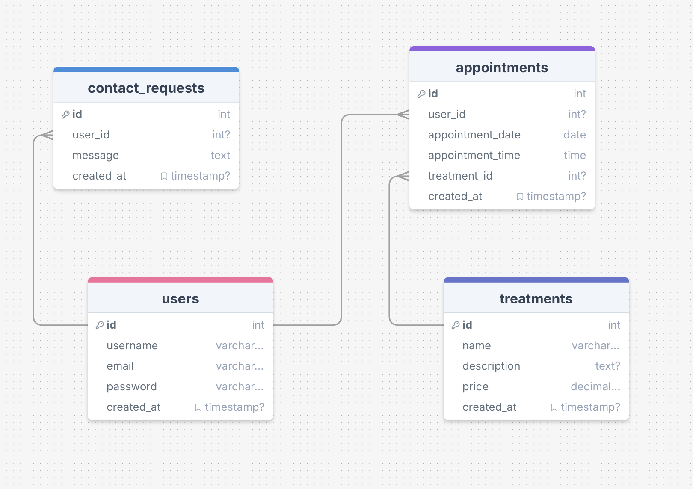

# SportsTherapy

SportsTherapy is a dedicated platform for individuals seeking personalized sports therapy and wellness solutions. Run by a sole practitioner, SportsTherapy emphasizes a holistic approach to health, offering specialized services including sports therapy, orthotics, and health coaching. Whether you're aiming to enhance your athletic performance, recovering from an injury, or interested in improving your overall health, SportsTherapy is here to provide tailored support and expert guidance.

Visit the deployed website [here](https://pp4-physio-4e914098e1ff.herokuapp.com/).

## Table of Contents

1. [User Experience (UX)](#user-experience-ux)
    1. [Strategy](#strategy)
        1. [Project Goals](#project-goals)
        2. [User Stories](#user-stories)
        3. [Strategy Table](#strategy-table)
    2. [Scope](#scope)
        1. [Kanban Board](#kanban-board)
    3. [Structure](#structure)
        1. [Flowchart](#flowchart)
        3. [Database model](#database-model)
    4. [Skeleton](#skeleton)
        1. [Wireframe](#wireframe)
    5. [Surface](#surface)
        1. [Color Scheme](#color-scheme)
        2. [Typography](#typography)
2. [Features](#features)
    1. [General](#general)
    2. [Home Page](#home-page)
    3. [About Page](#about-page)
    4. [Treatments](#treatments)
    5. [My Appointments](#my-appointments)
    6. [Error Handling](#user-profile)
    7. [Authentication Pages](#authentication-pages)
3. [Technologies Used](#technologies-used)
    1. [Languages Used](#languages-used)
    2. [Libraries and Frameworks](#libraries-and-frameworks)
    3. [Packages / Dependencies Installed](#packages--dependencies-installed)
    4. [Database Management](#database-management)
    5. [Tools and Programs](#tools-and-programs)
4. [Testing](#testing)
    1. [Go to TESTING.md](https://github.com/Alvor1991/PP4-SportsTherapy/blob/main/TESTING.md)
5. [Deployment](#deployment)
6. [Finished Product](#finished-product)
7. [Credits](#credits)
8. [Known Bugs](#known-bugs)
9. [Acknowledgements](#acknowledgements)


***


## User Experience (UX)

### Strategy

#### Project Goals

* Provide a user-friendly interface for clients to book therapy appointments.

* Implement a responsive design to ensure accessibility across various devices.

* Allow clients to manage their bookings easily through a personal dashboard.

* Ensure secure authentication and data handling.

#### User Stories

1. As a user, I can register an account so that I can book and manage my appointments online.

2. As an admin, I can manage website content so that I can keep info up-to-date and relevant for users.

3. As a user, I can access the website on any device so that I have a seamless experience on all devices.

4. As a user, I can view the home page to get an overview of services so I can learn more about the website.

5. As a user, I can view info about the therapist so that I can learn about their credentials and expertise.

6. As a user, I can view a list of available treatments so that I can choose the appropriate therapy session.

7. As a user, I can create an appointment so that I can schedule a therapy session.

8. As a user, I can view a list of my appointments so that I can see my scheduled therapy sessions.

9. As a user, I can update my appointments so that I can change the details of a scheduled session.

10. As a user, I can delete my appointments so that I can cancel a session I no longer need.

#### Strategy Table

Opportunity / Problem | Importance | Viability / Feasibility
--- | --- | ---
Responsive design | 5 | 5
Account registration | 5 | 5
Browse treatments | 5 | 5
Book appointments | 5 | 5
Manage appointments | 5 | 5
User appointments dashboard | 5 | 4
**Future Implementations:**
Integration with payment gateway | 3 | 2
Email notifications for booking confirmations | 3 | 2
Expand to include blog for sharing tips | 2 | 2
Expand to include more therapists | 2 | 2
**Total** | **40** | **37**


### Scope

According to the strategy table, not all features can be implemented in the first release of the project. For this reason, the project will be divided in multiple phases, as shown below:

| **First Phase**                   | **Second Phase**                                     |
|-----------------------------------|------------------------------------------------------|
| Responsive design                 | Integration with payment gateway                     |
| Account registration              | Email notifications for booking confirmations        |
| Browse and view treatments        | Blog page for sharing tips                           |
| Book and manage appointments      | Ability to add more therapists to the site           |

#### Kanban board

GitHub Projects was used as a project management tool with a Kanban board to track these user stories and monitor progress. **Story points** were assigned to these user stories, using the Fibonacci sequence (3, 5, 8) to represent the relative complexity and effort involved in each task:

**Start**


**Week 1**


**Week 2**


**Week 3**


### Structure

#### Flowchart

The website is organized using a [Mermaid](https://mermaid.js.org/) Flowchart to illustrate the user journey and interactions, ensuring intuitive navigation and a seamless user experience. The chart outlines the interactions available to both logged-in and logged-out users, illustrating how they navigate through the site's features.


##### User Flow

###### Non-Logged-In Users:
* **Home Page**: an overview of the services offered, client testimonials, and quick links to book an appointment
* **About Page**: detailed info about the therapist's credentials and philosophy. It also includes a contact form.
* **Treatments Page**: all available treatments with descriptions and pricing, along with a FAQ section.
* **Login Page**: allows users to log in to access personalized features like appointment management.
* **Book Appointment**: direct access to booking form; redirects users to log in before booking an appointment.

###### Logged-In Users:
* **Home Page**: same for non-logged-in users.
* **About Page**: same for non-logged-in users.
* **Treatments Page**: same for non-logged-in users.
* **My Appointments Page**: allows users to view, edit, or delete their scheduled appointments.
* **Logout**: allows users to log out of their account securely.
* **Book Appointment**: direct accesses to booking form; users can schedule their appointments.

#### Database Model

The database model was designed using [drawsql](https://drawsql.app/) and is managed with [PostgreSQL](https://www.postgresql.org/), a relational database.



##### Home App

###### ClientTestimonial Model

The `ClientTestimonial` model model manages and displays client feedback on the website.

* **Client Name**: A `CharField` that stores the name of the client providing the testimonial.
* **Testimonial Text**: A `TextField` containing testimonials provided by users.
* **Active**: A `BooleanField` indicating whether the testimonial is currently active and displayed on the website. 
* **Date Added**: A `DateTimeField` of when the testimonial was added, allowing for tracking of feedback.

##### About App

###### About Model

The `About` model is designed to manage and present detailed information about the therapist.

* **Title**: A `CharField` that stores the title of the "About Me" section.
* **Content**: A `TextField` containing the main content of the "About Me" section.

###### ContactRequest Model

The `ContactRequest` model allows for efficient handling of client inquiries and communication.

* **Name**: A `CharField` storing the name of the individual making the contact request.
* **Email**: An `EmailField` capturing the email address of the requester.
* **Message**: A `TextField` containing the message or inquiry sent by the individual.
* **Read**: A `BooleanField` indicating whether the message has been read. Defaults to `False`.
* **Created On**: A `DateTimeField` that records when the contact request was created.

##### Treatments App

###### Treatment Model

Each treatment offered by the therapist is detailed in the `Treatment` model.

* **Name**: A `CharField` storing the name of the treatment.
* **Description**: A `TextField` providing a detailed description of the treatment.
* **Services Offered**: An optional `TextField` detailing the services provided as part of the treatment.
* **Benefits**: An optional `TextField` outlining the benefits of the treatment.
* **Price**: A `DecimalField` indicating the price of the treatment, up to two decimal places.
* **Image**: A `CloudinaryField` to store an optional image associated with the treatment.
* **Button Text**: A `CharField` providing default text for call-to-action buttons related for booking appointments.

**FAQ Model**

The `FAQ` model is used to manage frequently asked questions.

* **Question**: A `CharField` storing the frequently asked questions.
* **Answer**: A `TextField` containing the answer to the question.

##### Appointments App

###### Appointment Model

The `Appointment` model facilitates the scheduling & management of therapy sessions.

* **User**: A foreign key from the `User` model that stores the client who has booked the appointment.
* **Date**: The date of the appointment, stored as a `DateField`.
* **Time**: The time of the appointment, stored as a `TimeField`.
* **Treatment**: A `CharField` representing the type of treatment selected for the appointment.

### Skeleton

#### Wireframes

[Balsamiq](https://balsamiq.com/) was used to create a layout of the website in the planning phase. Here are my initial designs: 

Page | Desktop Version | Mobile Version
--- | --- | ---
Login |  | 
Sign Up |  | 
Home |  | 
About |  | 
Treatments |  | 
Book Appointment |  | 
View Appointments |  | 


### Surface

#### Color Scheme


The following colours were chosen to create a calming, professional, and accessible user experience:

- **Primary Color (Teal Green):** `#0a5d61` - used for headings, buttons, and key interface elements
  - represents trust, professionalism, and health, which aligns with the therapeutic nature of the site.

- **Accent Color (Lighter Teal):** `#1fa2a2` - used for hover effects and interactions
  - provides a subtle contrast that enhances the user experience without being overly aggressive.

- **Secondary Color (Dark Gray):** `#333333` - used for body text and general content
  - ensures readability while complementing the primary teal.

- **Highlight Color (Crimson Red):** `#8B0000` - used sparingly actions such as cancel & delete buttons
  - effectively draws attention without clashing with the overall design.

- **Neutral Background (Light Gray):** `#fdfdfb` - used as the primary background color
  - provides a clean and neutral backdrop that allows the content to stand out.

- **Link Color:** `#0a5d61` - styled with the primary teal color, maintaining consistency across the site

#### Typography

This typography setup is designed to create a clear, user-friendly reading experience while supporting the professional tone of the website.

- **Primary Font - Roboto:**
  - **Usage:** Utilized for body text, general content, and links, offering a modern and clean look.

- **Secondary Font - Montserrat:**
  - **Usage:** Applied to all headings, providing a strong and professional visual hierarchy.

- **Tertiary Font - Raleway:**
  - **Usage:** Reserved for buttons and call-to-actions, ensuring these elements are distinct and noticeable.


[Back to top ⇧](#sports-therapy)

## Features

### General

* Mobile-first, responsive design for all devices, ensuring a seamless experience.
* Consistent navigation across all pages with hover effects for feedback, enhancing usability.
* The navbar adapts based on user authentication status:

    - **Home:** Redirects to the home page for easy navigation back to the main site.
    - **About:** Provides access to detailed information about the therapist, their credentials, and philosophy.
    - **Treatments:** Directs users to a page listing available treatments with descriptions and pricing.
    - **My Appointments:** (Visible only to logged-in users) Allows users to view their scheduled appointments.
    - **Login/Logout Link:** Displays the login option for guests and a logout option for authenticated users.
    - **Book Appointment Button:** redirects users to the appointment booking page.
* Footer with contact info and social media links.

### Home Page

* Overview of services, giving visitors a quick insight into the offerings and expertise.
* Quick links to book an appointment or view therapist profile, facilitating easy navigation and action.
* Client testimonials carousel, showcasing positive feedback from clients to build trust and credibility.

### About Page

* Detailed info about the therapist and credentials, helping clients understand expertise & approach.
* Contact form for inquiries, allowing visitors to reach out with questions or requests for more information.

### Treatments Page

* List of available treatments with descriptions & pricing, providing clear & detailed info about services offered.
* FAQ section to address common client questions, providing quick information.

### My Appointments

* Book Appointment: easy-to-use booking form allowing users to select dates, times, and treatment types.
* View Appointments: dashboard for registered users to view their scheduled appointments.
* Update Appointment: users can edit appointments, providing flexibility to manage their schedules.
* Delete Appointment: user can cancel appointments if no longer needed.
* Confirmation messages after successful bookings, updates & deletions to inform users of appointment status.

### Error Handling

* Custom 404-error page to inform users and redirect them appropriately if they encounter a broken link.

### Authentication Pages

* Sign up: allows the User to sign up for an account on the website.
* Login: allows the User to sign in with their account.

[Back to top ⇧](#sports-therapy)


## Technologies Used

### Languages Used

* [HTML5](https://en.wikipedia.org/wiki/HTML)
* [CSS3](https://en.wikipedia.org/wiki/CSS)
* [JavaScript](https://en.wikipedia.org/wiki/JavaScript)
* [Python](https://en.wikipedia.org/wiki/Python_(programming_language))

### Libraries and Frameworks

* [Django](https://www.djangoproject.com/) - was used as web framework.
* [Django Template](https://docs.djangoproject.com/en/5.1/topics/templates/) - was used as a templating language for Django to display backend data to HTML.
* [Bootstrap 5](https://getbootstrap.com/docs/5.0/getting-started/introduction/) - was used to help with styling and responsiveness.
* [Google Fonts](https://fonts.google.com) - was used to import the fonts into the HTML file.
* [Font Awesome](https://fontawesome.com) - was used throughout the website to add icons for aesthetic and UX purposes.

### Packages / Dependencies Installed

* [Django Allauth](https://docs.allauth.org/en/latest/) - used for user authentication, registration, and account management.
* [Django Crispy Form](https://django-crispy-forms.readthedocs.io/en/latest/) - used to control the rendering of the forms.
* [Summernote](https://summernote.org/) - was used as a WYSIWYG editor.
* [Cloudinary](https://cloudinary.com/) - was used as an image management solution.

### Database Management

* [Heroku Postgres](https://www.heroku.com/postgres) - was used in production, as a service based on PostgreSQL provided by Heroku.

### Tools and Programs

* [GitPod](https://gitpod.io/) - used for writing code, committing, and then pushing to GitHub.
* [GitHub](https://github.com) - used to store the project's code after being pushed from Git.
* [Heroku](https://www.heroku.com) - used to deploy the website.
* [Am I Responsive](ami.responsivedesign.is) - used to preview the website across a variety of popular devices.
* [Coolors](https://coolors.co) - was used to create a color scheme for the website.
* [Balsamiq](https://balsamiq.com/) - was used to create the wireframes during the design phase of the project.
* [Chrome DevTools](https://developer.chrome.com/docs/devtools/) - used during development process for code review and to test responsiveness.
* [W3C Markup Validator](https://validator.w3.org/) - used to validate the HTML code.
* [W3C CSS Validator](https://jigsaw.w3.org/css-validator/) - used to validate the CSS code.
* [JSHint](https://jshint.com/) - used to validate the site's JavaScript code.
* [Favicon.cc](https://www.favicon.cc/) - used to create the site favicon.


[Back to top ⇧](#sports-therapy)

## Testing

The testing documentation can be found [here](https://github.com/Alvor1991/PP4-SportsTherapy/blob/main/TESTING.md).


[Back to top ⇧](#sports-therapy)

## Deployment

Project developed using a [GitPod](https://gitpod.io/) workspace. The code was committed to [Git](https://git-scm.com/) and pushed to [GitHub](https://github.com/").

### Deploying on Heroku
To deploy this page to Heroku from its GitHub repository, the following steps were taken:

1. Create the Heroku App:
    - Select "Create new app" in Heroku.
    - Choose a name for your app and select the location.

2. Attach the Postgres database:
    - In the Resources tab, under add-ons, type in Postgres and select the Heroku Postgres option.

3. Prepare the environment and settings.py file:
    * In the Settings tab, click on Reveal Config Vars and copy the url next to DATABASE_URL.
    * In your GitPod workspace, create an env.py file in the main directory. 
    * Add the DATABASE_URL value and your chosen SECRET_KEY value to the env.py file.
    * Add the SECRET_KEY value to the Config Vars in Heroku.
    * Update the settings.py file to import the env file and add the SECRETKEY and DATABASE_URL file paths.
    * Update the Config Vars with the Cloudinary url, adding into the settings.py file also.
    * In settings.py add the following sections:
        * Cloudinary to the INSTALLED_APPS list
        * STATICFILE_STORAGE
        * STATICFILES_DIRS
        * STATIC_ROOT
        * MEDIA_URL
        * DEFAULT_FILE_STORAGE
        * TEMPLATES_DIR
        * Update DIRS in TEMPLATES with TEMPLATES_DIR
        * Update ALLOWED_HOSTS with ['app_name.heroku.com', 'localhost']

4. Store Static and Media files in Cloudinary and Deploy to Heroku:
    - Create three directories in the main directory; media, storage and templates.
    - Create a file named "Procfile" in the main directory and add the following:
        - web: gunicorn project-name.wsgi
    - Go to Deploy tab on Heroku and connect to the GitHub, then to the required repository.
    Click on Delpoy Branch and wait for the build to load. When the build is complete, the app can be opened through Heroku.

### Forking the Repository
By forking the GitHub Repository we make a copy of the original repository on our GitHub account to view and/or make changes without affecting the original repository by using the following steps...

1. Log into [GitHub](https://github.com/login) or [create an account](https://github.com/join).
2. Locate the [GitHub Repository](https://github.com/Alvor1991/PP4-SportsTherapy).
3. At the top of the repository, on the right side of the page, select "Fork"
4. You should now have a copy of the original repository in your GitHub account.

### Creating a Clone
How to run this project locally:
1. Install the [GitPod Browser](https://www.gitpod.io/docs/browser-extension/ "Link to Gitpod Browser extension download") Extension for Chrome.
2. After installation, restart the browser.
3. Log into [GitHub](https://github.com/login "Link to GitHub login page") or [create an account](https://github.com/join "Link to GitHub create account page").
2. Locate the [GitHub Repository](https://github.com/Alvor1991/PP4-SportsTherapy).
5. Click the green "GitPod" button in the top right corner of the repository.
This will trigger a new gitPod workspace to be created from the code in github where you can work locally.

How to run this project within a local IDE, such as VSCode:

1. Log into [GitHub](https://github.com/login) or [create an account](https://github.com/join).
2. Locate the [GitHub Repository](https://github.com/Alvor1991/PP4-SportsTherapy).
3. Under the repository name, click "Clone or download".
4. In the Clone with HTTPs section, copy the clone URL for the repository.
5. In your local IDE open the terminal.
6. Change the current working directory to the location where you want the cloned directory to be made.
7. Type 'git clone', and then paste the URL you copied in Step 3.
```
git clone https://github.com/Alvor1991/PP4-SportsTherapy
```
8. Press Enter. Your local clone will be created.

Further reading and troubleshooting on cloning a repository from GitHub [here](https://docs.github.com/en/free-pro-team@latest/github/creating-cloning-and-archiving-repositories/cloning-a-repository)


[Back to top ⇧](#sports-therapy)

## Finished Product

Page | Desktop | Mobile |
--- | --- | --- |
| Nav Bar |  |  |
| Home |  |  |
| About |  |  |
| Book Appointment |  |  |
| User Appointments |  |  |
| Update Appointment |  |  |
| Delete Appointment |  |  |
| Sign Up |  |  |
| Sign In |  |  |
| 404 Error |  |  |


[Back to top ⇧](#sports-therapy)

## Credits

### Content

* Website content was written by the developer.
* Example questions and replies were taken from [Stack Overflow](https://stackoverflow.com/)

### Media

[iStock](https://www.istockphoto.com/) was used for images on the site.

* Health Coaching image: taken by [designer491](https://www.pexels.com/@buro-millennial-636760/).
* Orthotics image: taken by [Andrey Popov](https://www.pexels.com/@buro-millennial-636760/).
* Ort image: taken by [Andrey Popov](https://www.pexels.com/@buro-millennial-636760/).

### Code

* [Stack Overflow](https://stackoverflow.com/) and [W3Schools](https://www.w3schools.com/) were consulted on a regular basis for inspiration.

* Initial structcure and base HTML code was taken from [Code Institute](https://codeinstitute.net/)'s django-blog project.

[Back to top ⇧](#sports-therapy)

## Known Bugs

**Issue:**  
When a user attempts to delete an appointment from the "User Appointments" dashboard, the modal pops up correctly on most devices. This functionality has been tested and works as expected on various screen sizes using Google Chrome's inspect tool. However, when the delete action is performed directly on an iPhone, the entire screen becomes greyed out, and the modal is visible but not clickable.

**Technical Explanation:**  
This issue is likely due to how iOS handles modal dialogs and stacking contexts, causing the backdrop to incorrectly layer over the modal content. As a result, the modal is displayed but not interactable.

**Current Status:**  
Due to project time constraints, this issue cannot be resolved at the moment. A potential fix could involve adjusting the CSS z-index and position properties, but this will need to be addressed in a future update.


[Back to top ⇧](#sports-therapy)

## Acknowledgements

* My tutor, Marcel, for his  feedback and guidance.

* Code Institute and the Slack community.

[Back to top ⇧](#sports-therapy)