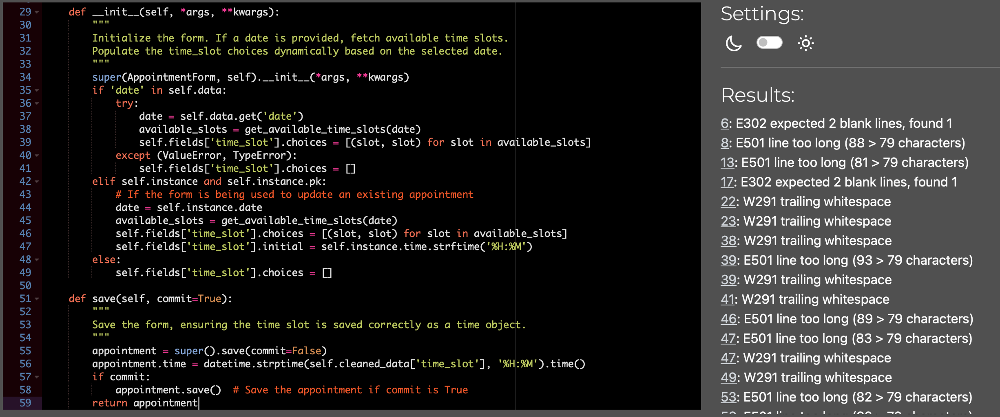
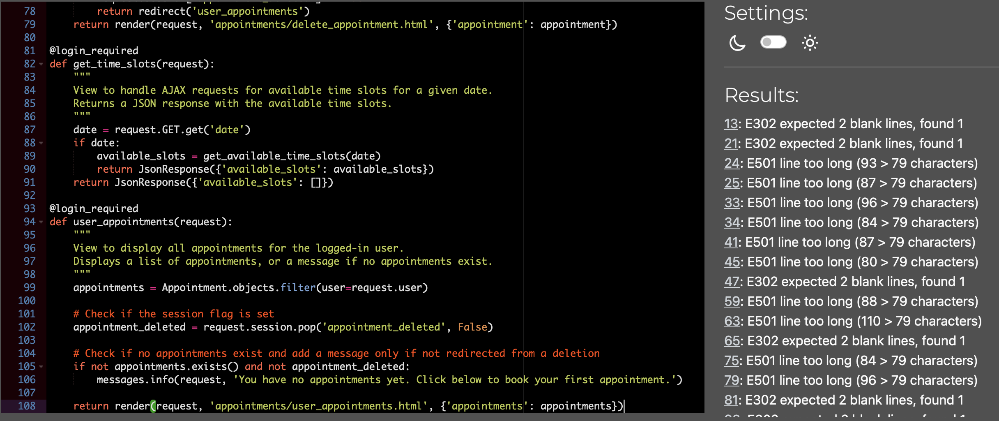

# Sports Therapy Website Testing

[Back to the README.md file](https://github.com/yourusername/sports-therapy-website#sports-therapy-website)  

[Back to the Testing section in the README.md file](https://github.com/yourusername/sports-therapy-website#testing)

[View the live website here](https://your-live-website-link.com/)  

## Table of Contents

1. [Testing User Stories](#testing-user-stories)
2. [Code Validation](#code-validation)
3. [Accessibility](#accessibility)
4. [Tools Testing](#tools-testing)
5. [Manual Testing](#manual-testing)

***

## Testing User Stories

##### 1. User can register an account to book and manage appointments (**3 Story Points**)
* AC1: Register with a form, account is created.
* AC2: Valid username and password register the account.
* AC3: Redirected to "My Profile" page, see a no bookings message.

##### 2. Admin can manage content to keep info up-to-date (**8 Story Points**)
* AC1: Admin dashboard access to edit/update content.
* AC2: Treatment updates reflected on the public site.
* AC3: Edit treatment content and prices accurately.

##### 3. User can access the website on any device for a seamless experience (**3 Story Points**)
* AC1: Website layout adjusts to fit mobile screens.
* AC2: Content remains readable when resizing the browser.
* AC3: Navigation menu collapses into mobile-friendly version.

##### 4. User can view the home page to get an overview of services (**3 Story Points**)
* AC1: Home page shows introduction and service overview.
* AC2: Scroll to see user testimonials.
* AC3: Call-to-action buttons for booking or learning more.

##### 5. User can view therapist info to learn about credentials (**3 Story Points**)
* AC1: About page shows therapist’s biography and credentials.
* AC2: Read content to understand services and experience.
* AC3: Contact form for questions or more information.

##### 6. User can view treatments to choose appropriate therapy (**5 Story Points**)
* AC1: Treatments page lists available services.
* AC2: Click on treatment to see detailed description.
* AC3: Understand benefits and pricing of each treatment.

##### 7. User can create an appointment to schedule a therapy session (**5 Story Points**)
* AC1: Booking form shows available slots.
* AC2: Selected treatment is added to the booking.
* AC3: Confirmation received once appointment is created.

##### 8. User can view appointments to see scheduled sessions (**5 Story Points**)
* AC1: Log in to see upcoming and past bookings.
* AC2: View details like date, time, and treatment.
* AC3: Navigate to detailed appointment information.

##### 9. User can update appointments to change session details (**5 Story Points**)
* AC1: Edit appointment to see current details.
* AC2: Update date, time, or treatment, reflecting changes.
* AC3: Confirmation received after updating appointment.

##### 10. User can delete appointments to cancel a session (**5 Story Points**)
* AC1: Delete appointment prompts for confirmation.
* AC2: Confirm to remove appointment from the list.
* AC3: Message confirms appointment cancellation.

## Code Validation

### HTML

The [W3C Markup Validator](https://validator.w3.org/) service was used to validate the HTML code of the project to ensure there were no syntax errors.

W3C Markup Validator found the following errors in `base.html`:

To resolve the error, I moved the modal inside the body tag.

W3C Markup Validator found the following errors in `treatments.html`:

To resolve the error, I wrapped content with a div instead of p and removed redundant closing tags. 

### CSS

[W3C CSS Validator](https://jigsaw.w3.org/css-validator/) service was used to validate the CSS code of the project to ensure there were no syntax errors.

W3C CSS Validator found no errors or warnings in the CSS.

### Python

[PEP8 online](http://pep8online.com/) was used to validate the Python code for PEP8 compliance. As there many files to assess within each app, I have focused on the appointment app for this testing section. 

| Location | Errors / Warnings | Code Reviewed |
| --- | --- | --- |
| ./appointments/model.py |  |  |
| ./appointments/views.py |  |  |
| ./appointments/urls.py |  |  |

Outside of trailing whitespace and code comments, there were additional issues related to splitting long lines. For example:
* In the treatment field, the line was divided into three parts: `max_length`, `choices`, and `default`. Each part is now on a separate line to keep the overall line length under 79 characters.
* The `__str__` method's return statement was split into two lines using string concatenation, ensuring each line remains within the 79-character limit.

### JavaScript

[JSHint's JavaScript Code Quality Tool](https://jshint.com/) was used to validate the site's JavaScript code.

No errors were found.

## Accessibility

Lighthouse in Chrome DevTools was used to confirm that colors & fonts used throughout the website are easy to read and accessible.

### Lighthouse Reports

Page | Lighthouse Report |
| --- | --- |
| Home |  |
| About |  |
| Treatments |  |
| My appointments |  |
| Login |  |
| Signup |  |

## Tools Testing

### [Chrome DevTools](https://developer.chrome.com/docs/devtools/)

Chrome DevTools was used throughout the development process to test, explore, and modify HTML elements and CSS styles.

### Responsiveness

* [Am I Responsive?](http://ami.responsivedesign.is/#) was used to check the responsiveness of the site pages across different devices.

* Chrome DevTools was used to test responsiveness in different screen sizes during the development process.

## Manual Testing

### Browser Compatibility

Browser | Outcome | Pass/Fail | 
--- | --- | --- |
Google Chrome | No appearance, responsiveness, or functionality issues.| Pass |
Safari | No appearance, responsiveness, or functionality issues. | Pass |
Mozilla Firefox | No responsiveness or functionality issues.| Pass |
Microsoft Edge | No appearance, responsiveness, or functionality issues. | Pass |

### Device Compatibility

Device | Operating System | Outcome | Pass/Fail
--- | --- | --- | --- |
MacBook Pro 15" | macOS Big Sur | No appearance, responsiveness, or functionality issues. | Pass |
iPad Pro 12.9" | iOS 15 | No appearance, responsiveness, or functionality issues. | Pass |
iPhone XR | iOS 15 | No appearance, responsiveness, or functionality issues. | Pass |
iPhone SE | iOS 15 | No appearance, responsiveness, or functionality issues. | Pass |

### Test Results

#### Base HTML 

<table>
    <tr>
        <th colspan=2>Feature</th>
        <th>Users</th>
        <th>Test</th>
        <th>Outcome</th>
        <th>Pass/Fail</th>
    </tr>
    <tr>
        <td rowspan=16>Navigation Bar</td>
        <td rowspan=2>Main logo link</td>
        <td rowspan=2>All</td>
        <td>Functionality</td>
        <td>Clicking the link redirects to the Home page.</td>
        <td>Pass</td>
    </tr>
    <tr>
        <td>Style</td>
        <td>Hover effect working as expected.</td>
        <td>Pass</td>
    </tr>
    <tr>
        <td rowspan=2>Home link</td>
        <td rowspan=2>All</td>
        <td>Functionality</td>
        <td>Clicking the link redirects to the Home page.</td>
        <td>Pass</td>
    </tr>
    <tr>
        <td>Style</td>
        <td>Hover effect working as expected.</td>
        <td>Pass</td>
    </tr>
    <tr>
        <td rowspan=2>About link</td>
        <td rowspan=2>All</td>
        <td>Functionality</td>
        <td>Clicking the link redirects to the About page.</td>
        <td>Pass</td>
    </tr>
    <tr>
        <td>Style</td>
        <td>Hover effect working as expected.</td>
        <td>Pass</td>
    </tr>
    <tr>
        <td rowspan=2>Treatments link</td>
        <td rowspan=2>Unregistered</td>
        <td>Functionality</td>
        <td>Clicking the link redirects to the Treatments page.</td>
        <td>Pass</td>
    </tr>
    <tr>
        <td>Style</td>
        <td>Hover effect working as expected.</td>
        <td>Pass</td>
    </tr>
    <tr>
        <td rowspan=2>Login link</td>
        <td rowspan=2>Unregistered</td>
        <td>Functionality</td>
        <td>Clicking the link redirects to the Login page.</td>
        <td>Pass</td>
    </tr>
    <tr>
        <td>Style</td>
        <td>Hover effect working as expected.</td>
        <td>Pass</td>
    </tr>
    <tr>
        <td rowspan=2>My Appointments link</td>
        <td rowspan=2>Registered</td>
        <td>Functionality</td>
        <td>Clicking the link redirects to the Appointments page.</td>
        <td>Pass</td>
    </tr>
    <tr>
        <td>Style</td>
        <td>Hover effect working as expected.</td>
        <td>Pass</td>
    </tr>
    <tr>
        <td rowspan=2>Logout link</td>
        <td rowspan=2>Registered</td>
        <td>Functionality</td>
        <td>Clicking the link logs out the user and redirects to the Home page.</td>
        <td>Pass</td>
    </tr>
    <tr>
        <td>Style</td>
        <td>Hover effect working as expected.</td>
        <td>Pass</td>
    </tr>
    <tr>
        <td rowspan=2>Responsive Toggle Menu</td>
        <td rowspan=2>All</td>
        <td>Functionality</td>
        <td>Clicking the button toggles the navigation menu.</td>
        <td>Pass</td>
    </tr>
    <tr>
        <td>Style</td>
        <td>Responsive navigation menu on smaller screens. Hover effect working as expected.</td>
        <td>Pass</td>
    </tr>
    <tr>
        <td rowspan=8>Footer</td>
        <td rowspan=2>Facebook icon</td>
        <td rowspan=2>All</td>
        <td>Functionality</td>
        <td>Clicking the link opens Facebook page on a separate tab.</td>
        <td>Pass</td>
    </tr>
    <tr>
        <td>Style</td>
        <td>Hover effect working as expected.</td>
        <td>Pass</td>
    </tr>
    <tr>
        <td rowspan=2>Instagram icon</td>
        <td rowspan=2>All</td>
        <td>Functionality</td>
        <td>Clicking the link opens Instagram page on a separate tab.</td>
        <td>Pass</td>
    </tr>
    <tr>
        <td>Style</td>
        <td>Hover effect working as expected.</td>
        <td>Pass</td>
    </tr>
    <tr>
        <td rowspan=2>Logo link</td>
        <td rowspan=2>All</td>
        <td>Functionality</td>
        <td>Clicking the link redirects to the home page.</td>
        <td>Pass</td>
    </tr>
    <tr>
        <td>Style</td>
        <td>Hover effect working as expected.</td>
        <td>Pass</td>
    </tr>
    <tr>
        <td>Main Content Area</td>
        <td>All</td>
        <td>Functionality</td>
        <td>Main content area renders correctly and displays the page-specific content.</td>
        <td>Pass</td>
    </tr>
    <tr>
        <td>Main Content Area</td>
        <td>All</td>
        <td>Style</td>
        <td>Main content area is styled correctly and is responsive across all devices.</td>
        <td>Pass</td>
    </tr>
</table>

#### Home Page 

<table>
    <tr>
        <th colspan=2>Feature</th>
        <th>Users</th>
        <th>Test</th>
        <th>Outcome</th>
        <th>Pass/Fail</th>
    </tr>
    <tr>
        <td rowspan=2>Page Buttons</td>
        <td rowspan=2>Book Appointment button</td>
        <td rowspan=2>All</td>
        <td>Functionality</td>
        <td>Clicking the button redirects to the Booking page.</td>
        <td>Pass</td>
    </tr>
    <tr>
        <td>Style</td>
        <td>Hover effect working as expected.</td>
        <td>Pass</td>
    </tr>
    <tr>
        <td rowspan=4>Service Cards</td>
        <td rowspan=2>Learn More buttons</td>
        <td rowspan=2>All</td>
        <td>Functionality</td>
        <td>Clicking the button redirects to the Treatments page.</td>
        <td>Pass</td>
    </tr>
    <tr>
        <td>Style</td>
        <td>Hover effect working as expected.</td>
        <td>Pass</td>
    </tr>
    <tr>
        <td rowspan=2>Service Icons</td>
        <td rowspan=2>All</td>
        <td>Functionality</td>
        <td>Icons are displayed correctly and provide visual cues for each service.</td>
        <td>Pass</td>
    </tr>
    <tr>
        <td>Style</td>
        <td>Icons are styled consistently with the overall design.</td>
        <td>Pass</td>
    </tr>
    <tr>
        <td rowspan=4>Client Testimonials</td>
        <td rowspan=2>Carousel Controls</td>
        <td rowspan=2>All</td>
        <td>Functionality</td>
        <td>Clicking the controls navigates through the testimonials.</td>
        <td>Pass</td>
    </tr>
    <tr>
        <td>Style</td>
        <td>Carousel controls are styled consistently with overall design.</td>
        <td>Pass</td>
    </tr>
    <tr>
        <td rowspan=2>Testimonial Content</td>
        <td rowspan=2>All</td>
        <td>Functionality</td>
        <td>Testimonials display correctly and are readable.</td>
        <td>Pass</td>
    </tr>
    <tr>
        <td>Style</td>
        <td>Testimonials are styled consistently with the overall design.</td>
        <td>Pass</td>
    </tr>
    <tr>
        <td rowspan=4>Call to Action</td>
        <td rowspan=2>Book Now button</td>
        <td rowspan=2>All</td>
        <td>Functionality</td>
        <td>Clicking the button redirects to the Booking page.</td>
        <td>Pass</td>
    </tr>
    <tr>
        <td>Style</td>
        <td>Hover effect working as expected.</td>
        <td>Pass</td>
    </tr>
    <tr>
        <td rowspan=2>Contact Link</td>
        <td rowspan=2>All</td>
        <td>Functionality</td>
        <td>Clicking the link redirects to the About Me page.</td>
        <td>Pass</td>
    </tr>
    <tr>
        <td>Style</td>
        <td>Hover effect working as expected.</td>
        <td>Pass</td>
    </tr>
</table>

#### About Page 

<table>
    <tr>
        <th>Feature</th>
        <th>Users</th>
        <th>Test</th>
        <th>Outcome</th>
        <th>Pass/Fail</th>
    </tr>
    <tr>
        <td rowspan=2>Profile Image</td>
        <td rowspan=2>All</td>
        <td>Functionality</td>
        <td>Profile image displays correctly and is responsive.</td>
        <td>Pass</td>
    </tr>
    <tr>
        <td>Style</td>
        <td>Image is styled as a rounded circle with a border.</td>
        <td>Pass</td>
    </tr>
    <tr>
        <td rowspan=2>Content Sections</td>
        <td rowspan=2>All</td>
        <td>Functionality</td>
        <td>Content sections render correctly.</td>
        <td>Pass</td>
    </tr>
    <tr>
        <td>Style</td>
        <td>Even spacing between content sections, ensuring readability and a clean layout.</td>
        <td>Pass</td>
    </tr>
    <tr>
        <td rowspan=2>Icons</td>
        <td rowspan=2>All</td>
        <td>Functionality</td>
        <td>Icons for credentials are displayed correctly.</td>
        <td>Pass</td>
    </tr>
    <tr>
        <td>Style</td>
        <td>Icons are styled consistently with the overall design.</td>
        <td>Pass</td>
    </tr>
    <tr>
        <td rowspan=2>Contact Form</td>
        <td rowspan=2>All</td>
        <td>Functionality</td>
        <td>Contact form is displayed correctly and submissions are processed as expected.</td>
        <td>Pass</td>
    </tr>
    <tr>
        <td>Style</td>
        <td>Form fields are styled using Bootstrap's crispy forms for consistent design.</td>
        <td>Pass</td>
    </tr>
</table>

#### Treatments Page

<table>
    <tr>
        <th>Feature</th>
        <th>Users</th>
        <th>Test</th>
        <th>Outcome</th>
        <th>Pass/Fail</th>
    </tr>
    <tr>
        <td rowspan=2>Card Display</td>
        <td rowspan=2>All</td>
        <td>Functionality</td>
        <td>Treatments are displayed as a card with an image, title, description, and a button.</td>
        <td>Pass</td>
    </tr>
    <tr>
        <td>Style</td>
        <td>Cards are evenly spaced and styled with a consistent design.</td>
        <td>Pass</td>
    </tr>
    <tr>
        <td rowspan=2>Treatment Image</td>
        <td rowspan=2>All</td>
        <td>Functionality</td>
        <td>Images for each treatment are displayed correctly and are responsive.</td>
        <td>Pass</td>
    </tr>
    <tr>
        <td>Style</td>
        <td>Images are styled to fit within the card layout without distortion.</td>
        <td>Pass</td>
    </tr>
    <tr>
        <td rowspan=2>Learn More Button</td>
        <td rowspan=2>All</td>
        <td>Functionality</td>
        <td>Button redirects to a detailed page for the specific treatment.</td>
        <td>Pass</td>
    </tr>
    <tr>
        <td>Style</td>
        <td>Button has a hover effect and is styled consistently with overall design.</td>
        <td>Pass</td>
    </tr>
    <tr>
        <td rowspan=2>FAQ Section</td>
        <td rowspan=2>All</td>
        <td>Functionality</td>
        <td>FAQ section displays correctly and each FAQ can be expanded to show answer.</td>
        <td>Pass</td>
    </tr>
    <tr>
        <td>Style</td>
        <td>FAQ section is styled with consistent spacing and design.</td>
        <td>Pass</td>
    </tr>
    <tr>
        <td rowspan=2>Accordion Functionality</td>
        <td rowspan=2>All</td>
        <td>Functionality</td>
        <td>Accordions expand and collapse correctly when clicked.</td>
        <td>Pass</td>
    </tr>
    <tr>
        <td>Style</td>
        <td>Accordions are styled to match the site's overall design, with smooth transitions.</td>
        <td>Pass</td>
    </tr>
</table>

#### Book Appointments Page

<table>
    <tr>
        <th>Feature</th>
        <th>Users</th>
        <th>Test</th>
        <th>Outcome</th>
        <th>Pass/Fail</th>
    </tr>
    <tr>
        <td rowspan=2>Booking Form</td>
        <td rowspan=2>Registered</td>
        <td>Functionality</td>
        <td>Form fields for date, time slot, and treatment render correctly and are functional.</td>
        <td>Pass</td>
    </tr>
    <tr>
        <td>Style</td>
        <td>Form fields are styled consistently and are user-friendly.</td>
        <td>Pass</td>
    </tr>
    <tr>
        <td rowspan=2>Submit Button</td>
        <td rowspan=2>Registered</td>
        <td>Functionality</td>
        <td>Clicking submit button successfully submits form & books appointment.</td>
        <td>Pass</td>
    </tr>
    <tr>
        <td>Style</td>
        <td>Button has a hover effect and is styled consistently with the overall design.</td>
        <td>Pass</td>
    </tr>
    <tr>
        <td rowspan=2>Cancel Button</td>
        <td rowspan=2>Registered</td>
        <td>Functionality</td>
        <td>Clicking the cancel button redirects back to the user appointments page without submitting the form.</td>
        <td>Pass</td>
    </tr>
    <tr>
        <td>Style</td>
        <td>Button has a hover effect and is styled consistently with overall design.</td>
        <td>Pass</td>
    </tr>
    <tr>
        <td rowspan=2>Date Field</td>
        <td rowspan=2>Registered</td>
        <td>Functionality</td>
        <td>Allows users to select a date for the appointment. Past dates are disabled.</td>
        <td>Pass</td>
    </tr>
    <tr>
        <td>Style</td>
        <td>Styled consistently with the overall design and is user-friendly.</td>
        <td>Pass</td>
    </tr>
    <tr>
        <td rowspan=2>Time Slot Field</td>
        <td rowspan=2>Registered</td>
        <td>Functionality</td>
        <td>Populates available time slots based on the selected date.</td>
        <td>Pass</td>
    </tr>
    <tr>
        <td>Style</td>
        <td>Time slot dropdown is styled consistently with overall design & is user-friendly.</td>
        <td>Pass</td>
    </tr>
    <tr>
        <td rowspan=2>Treatment Field</td>
        <td rowspan=2>Registered</td>
        <td>Functionality</td>
        <td>Allows users to select the desired treatment for the appointment.</td>
        <td>Pass</td>
    </tr>
    <tr>
        <td>Style</td>
        <td>Treatment dropdown is styled consistently with overall design & is user-friendly.</td>
        <td>Pass</td>
    </tr>
</table>

#### User Appointments Page

<table>
    <tr>
        <th>Feature</th>
        <th>Users</th>
        <th>Test</th>
        <th>Outcome</th>
        <th>Pass/Fail</th>
    </tr>
    <tr>
        <td rowspan=2>Appointments Table</td>
        <td rowspan=2>Registered</td>
        <td>Functionality</td>
        <td>Displays appointment details such as date, time and treatment correctly.</td>
        <td>Pass</td>
    </tr>
    <tr>
        <td>Style</td>
        <td>Styled consistently with the overall design and is responsive.</td>
        <td>Pass</td>
    </tr>
    <tr>
        <td rowspan=2>Update Button</td>
        <td rowspan=2>Registered</td>
        <td>Functionality</td>
        <td>Clicking the update button redirects to the update appointment page for correct appointment.</td>
        <td>Pass</td>
    </tr>
    <tr>
        <td>Style</td>
        <td>Button has a hover effect & is styled consistently with overall design.</td>
        <td>Pass</td>
    </tr>
    <tr>
        <td rowspan=2>Delete Button</td>
        <td rowspan=2>Registered</td>
        <td>Functionality</td>
        <td>Clicking the delete button triggers a confirmation modal for correct appointment.</td>
        <td>Pass</td>
    </tr>
    <tr>
        <td>Style</td>
        <td>Button has a hover effect and is styled consistently with overall design.</td>
        <td>Pass</td>
    </tr>
    <tr>
        <td rowspan=2>Delete Confirmation Modal</td>
        <td rowspan=2>Registered</td>
        <td>Functionality</td>
        <td>The modal displays the correct appointment details & allows the user to confirm or cancel deletion.</td>
        <td>Pass</td>
    </tr>
    <tr>
        <td>Style</td>
        <td>Modal is styled consistently with the overall design.</td>
        <td>Pass</td>
    </tr>
    <tr>
        <td rowspan=2>No Appointments Message</td>
        <td rowspan=2>Registered</td>
        <td>Functionality</td>
        <td>If no appointments are found, a message is displayed with a link to book an appointment.</td>
        <td>Pass</td>
    </tr>
    <tr>
        <td>Style</td>
        <td>Message is styled consistently with the overall design.</td>
        <td>Pass</td>
    </tr>
</table>

#### Update Appointments Page

<table>
    <tr>
        <th>Feature</th>
        <th>Users</th>
        <th>Test</th>
        <th>Outcome</th>
        <th>Pass/Fail</th>
    </tr>
    <tr>
        <td rowspan=2>Update Form</td>
        <td rowspan=2>Registered</td>
        <td>Functionality</td>
        <td>Users can update the date, time slot, and treatment for an appointment.</td>
        <td>Pass</td>
    </tr>
    <tr>
        <td>Style</td>
        <td>The form fields are styled consistently with the overall design.</td>
        <td>Pass</td>
    </tr>
    <tr>
        <td rowspan=2>Update Button</td>
        <td rowspan=2>Registered</td>
        <td>Functionality</td>
        <td>Clicking the update button successfully updates the appointment & redirects to user appointments.</td>
        <td>Pass</td>
    </tr>
    <tr>
        <td>Style</td>
        <td>Button has a hover effect and is styled consistently with overall design.</td>
        <td>Pass</td>
    </tr>
    <tr>
        <td rowspan=2>Cancel Button</td>
        <td rowspan=2>Registered</td>
        <td>Functionality</td>
        <td>Redirects back to the user appointments without making any changes.</td>
        <td>Pass</td>
    </tr>
    <tr>
        <td>Style</td>
        <td>Button is styled in red to indicate cancellation and has a hover effect.</td>
        <td>Pass</td>
    </tr>
</table>

#### Delete Appointments Page

<table>
    <tr>
        <th>Feature</th>
        <th>Users</th>
        <th>Test</th>
        <th>Outcome</th>
        <th>Pass/Fail</th>
    </tr>
    <tr>
        <td rowspan=2>Confirmation Message</td>
        <td rowspan=2>Registered</td>
        <td>Functionality</td>
        <td>Confirmation message displays the correct appointment date & time.</td>
        <td>Pass</td>
    </tr>
    <tr>
        <td>Style</td>
        <td>Message is styled consistently with the overall design.</td>
        <td>Pass</td>
    </tr>
    <tr>
        <td rowspan=2>Delete Button</td>
        <td rowspan=2>Registered</td>
        <td>Functionality</td>
        <td>Clicking the delete button successfully deletes the appointment & redirects to user appointments.</td>
        <td>Pass</td>
    </tr>
    <tr>
        <td>Style</td>
        <td>Button has a hover effect and is styled in red to indicate danger.</td>
        <td>Pass</td>
    </tr>
    <tr>
        <td rowspan=2>Cancel Button</td>
        <td rowspan=2>Registered</td>
        <td>Functionality</td>
        <td>Clicking the cancel button redirects back to the home page without deleting appointment.</td>
        <td>Pass</td>
    </tr>
    <tr>
        <td>Style</td>
        <td>Button has a hover effect and is styled consistently with overall design.</td>
        <td>Pass</td>
    </tr>
</table>

#### Signup Page

<table>
    <tr>
        <th>Feature</th>
        <th>Users</th>
        <th>Test</th>
        <th>Outcome</th>
        <th>Pass/Fail</th>
    </tr>
    <tr>
        <td rowspan=2>Signup Form</td>
        <td rowspan=2>All</td>
        <td>Functionality</td>
        <td>Form fields render correctly and accept user input.</td>
        <td>Pass</td>
    </tr>
    <tr>
        <td>Style</td>
        <td>Form fields are styled consistently with the overall design.</td>
        <td>Pass</td>
    </tr>
    <tr>
        <td rowspan=2>Sign Up Button</td>
        <td rowspan=2>All</td>
        <td>Functionality</td>
        <td>Clicking the button submits the form and attempts to register the user.</td>
        <td>Pass</td>
    </tr>
    <tr>
        <td>Style</td>
        <td>Button has a hover effect and is styled consistently with overall design.</td>
        <td>Pass</td>
    </tr>
    <tr>
        <td rowspan=2>Signin Link</td>
        <td rowspan=2>All</td>
        <td>Functionality</td>
        <td>Clicking the link redirects to the signin page.</td>
        <td>Pass</td>
    </tr>
    <tr>
        <td>Style</td>
        <td>Link has a hover effect and is styled consistently with overall design.</td>
        <td>Pass</td>
    </tr>
</table>

#### Login Page

<table>
    <tr>
        <th>Feature</th>
        <th>Users</th>
        <th>Test</th>
        <th>Outcome</th>
        <th>Pass/Fail</th>
    </tr>
    <tr>
        <td rowspan=2>Login Form</td>
        <td rowspan=2>All</td>
        <td>Functionality</td>
        <td>Form fields render correctly and accept user input.</td>
        <td>Pass</td>
    </tr>
    <tr>
        <td>Style</td>
        <td>Form fields are styled consistently with the overall design.</td>
        <td>Pass</td>
    </tr>
    <tr>
        <td rowspan=2>Sign In Button</td>
        <td rowspan=2>All</td>
        <td>Functionality</td>
        <td>Clicking the button submits the form and attempts to log the user in.</td>
        <td>Pass</td>
    </tr>
    <tr>
        <td>Style</td>
        <td>Button has a hover effect and is styled consistently with overall design.</td>
        <td>Pass</td>
    </tr>
    <tr>
        <td rowspan=2>Signup Link</td>
        <td rowspan=2>All</td>
        <td>Functionality</td>
        <td>Clicking the link redirects to the signup page.</td>
        <td>Pass</td>
    </tr>
    <tr>
        <td>Style</td>
        <td>Link has a hover effect and is styled consistently with overall design.</td>
        <td>Pass</td>
    </tr>
</table>