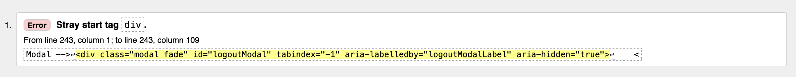
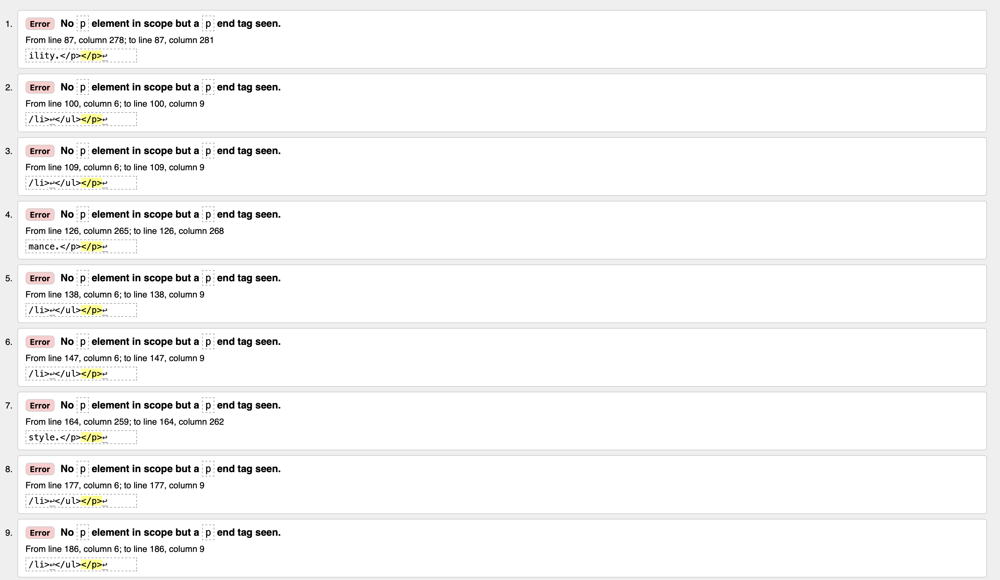
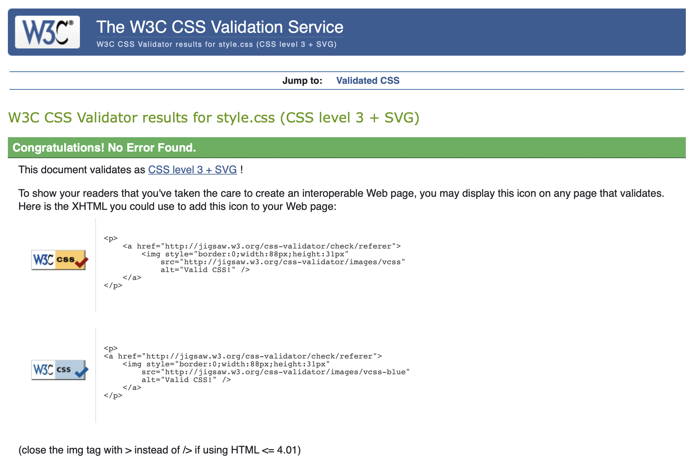
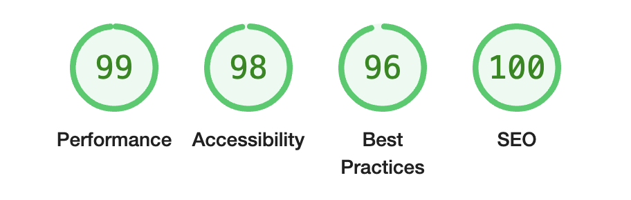
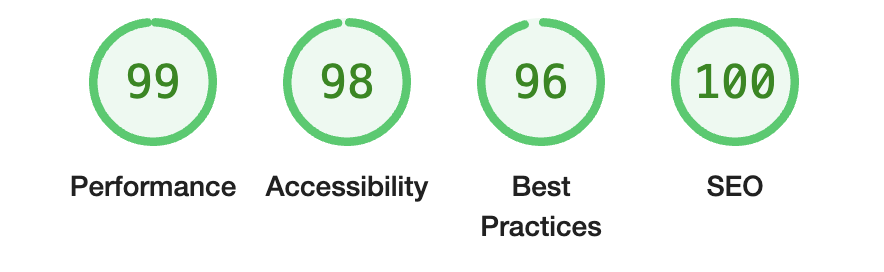
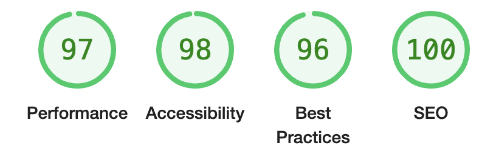
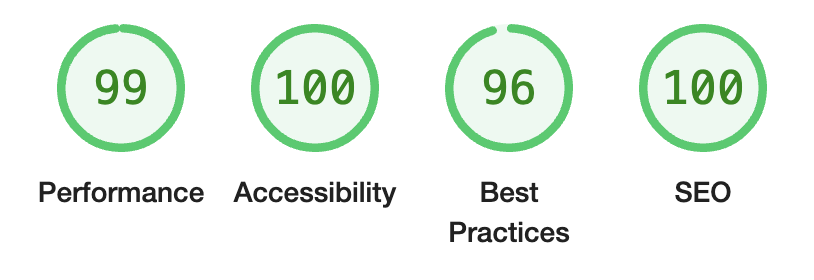
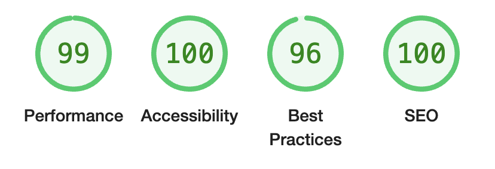
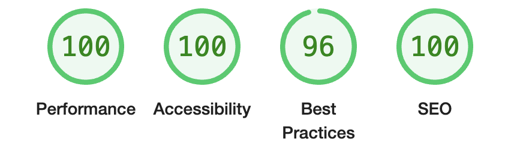

# Sports Therapy Website Testing

[Back to the README.md file](https://github.com/yourusername/sports-therapy-website#sports-therapy-website)  

[Back to the Testing section in the README.md file](https://github.com/yourusername/sports-therapy-website#testing)

[View the live website here](https://your-live-website-link.com/)  

## Table of Contents

1. [Testing User Stories](#testing-user-stories)
2. [Code Validation](#code-validation)
3. [Accessibility](#accessibility)
4. [Tools Testing](#tools-testing)
5. [Manual Testing](#manual-testing)

***

## Testing User Stories

### 1. As a user, I can register an account so that I can book and manage my appointments online

* AC1: Given a registration form, when I fill in my details and submit, my account is created.
* AC2: When I enter a valid username and password, my account is successfully registered.
* AC3: Then I am redirected to the "My Profile" page, where I see a message indicating that I have no bookings.

### 2. As an admin, I can manage website content so that I can keep info up-to-date and relevant for users

* AC1: Given an admin dashboard, when I log in, I can access tools to edit and update the content on various pages.
* AC2: When I update a treatment description, it is immediately reflected on the public site.
* AC3: Then I can edit treatment content and prices to ensure accurate information is displayed.

### 3. As a user, I can access the website on any device so that I have a seamless experience on all devices

* AC1: Given a mobile device, the website layout adjusts to fit the screen.
* AC2: When I resize the browser window, content remains readable and navigable.
* AC3: Then the navigation menu collapses into a mobile-friendly version.

### 4. As a user, I can view the home page to get an overview of the services so that I learn more about the website

* AC1: Given the home page, when I visit it, I see a welcoming introduction and an overview of available services.
* AC2: When I scroll down, I see user testimonials that highlight the effectiveness of the services.
* AC3: Then I see call-to-action buttons that direct me to book an appointment or learn more about treatments.

### 5. As a user, I can view info about the therapist so that I can learn about their credentials and expertise

* AC1: Given the about page, when I visit it, I can see the therapist’s biography and credentials.
* AC2: When I read the content, I understand the services offered and the therapist’s experience.
* AC3: Then I can use the contact form to ask questions or request more information.

### 6. As a user, I can view a list of available treatments so that I can choose the appropriate therapy session

* AC1: Given the treatments page, when I visit it, I see a list of available therapy services.
* AC2: When I click on a treatment, I see a detailed description.
* AC3: Then I understand the benefits and pricing of each treatment.

### 7. As a user, I can create an appointment so that I can schedule a therapy session

* AC1: Given a booking form, when I select a date and time, available slots are shown.
* AC2: When I select a treatment type, it is added to my booking.
* AC3: Then I receive a confirmation on the website once the appointment is created.

### 8. As a user, I can view a list of my appointments so that I can see my scheduled therapy sessions

* AC1: Given a list of appointments, when I log in, I can see upcoming and past bookings.
* AC2: When I view the list, I can see details such as date, time, and treatment.
* AC3: Then I can navigate to detailed appointment information if needed.

### 9. As a user, I can update my appointments so that I can change the details of a scheduled session

* AC1: Given an appointment, when I choose to edit it, a form with current details is displayed.
* AC2: When I update the date, time, or treatment, the appointment reflects these changes.
* AC3: Then I receive confirmation on the website that the appointment has been updated.

### 10. As a user, I can delete my appointments so that I can cancel a session I no longer need

* AC1: Given an appointment, when I choose to delete it, I am prompted for confirmation.
* AC2: When I confirm the deletion, the appointment is removed from my list.
* AC3: Then I see a message confirming that the appointment has been canceled.

## Code Validation

### HTML

The [W3C Markup Validator](https://validator.w3.org/) service was used to validate the HTML code of the project to ensure there were no syntax errors.

W3C Markup Validator found the following errors in `base.html`:

Moved the modal inside the body tag.

Wrapped Content with a div instead of p and removed redundant closing tags. 

### CSS

[W3C CSS Validator](https://jigsaw.w3.org/css-validator/) service was used to validate the CSS code of the project to ensure there were no syntax errors.

W3C CSS Validator found no errors or warnings in the CSS.

### Python

Pylint was used continuously during the development process to analyze the Python code for programming errors.

[PEP8 online](http://pep8online.com/) was further used to validate the Python code for PEP8 compliance. The validation results are shown below:

| Location | Errors / Warnings | Code Reviewed |
| --- | --- | --- |
| ./appointments/admin.py | No errors / warnings | |
| ./appointments/forms.py |  |  |
| ./appointments/models.py |  |  |
| ./appointments/urls.py |  |  |
| ./appointments/views.py |  |  |

### JavaScript

[JSHint's JavaScript Code Quality Tool](https://jshint.com/) was used to validate the site's JavaScript code.

No errors were found.

## Accessibility

Lighthouse in Chrome DevTools was used to confirm that the colors and fonts used throughout the website are easy to read and accessible.

### Lighthouse Reports

Page | Lighthouse Report |
| --- | --- |
| Index |  |
| About |  |
| Treatments |  |
| Login |  |
| Signup |  |
| My appointments |  |

## Tools Testing

### [Chrome DevTools](https://developer.chrome.com/docs/devtools/)

Chrome DevTools was used throughout the development process to test, explore, and modify HTML elements and CSS styles.

### Responsiveness

* [Am I Responsive?](http://ami.responsivedesign.is/#) was used to check the responsiveness of the site pages across different devices.

* Chrome DevTools was used to test responsiveness in different screen sizes during the development process.

## Manual Testing

### Browser Compatibility

Browser | Outcome | Pass/Fail | 
--- | --- | --- |
Google Chrome | No appearance, responsiveness, or functionality issues.| Pass |
Safari | No appearance, responsiveness, or functionality issues. | Pass |
Mozilla Firefox | No responsiveness or functionality issues.| Pass |
Microsoft Edge | No appearance, responsiveness, or functionality issues. | Pass |

### Device Compatibility

Device | Operating System | Outcome | Pass/Fail
--- | --- | --- | --- |
MacBook Pro 15" | macOS Big Sur | No appearance, responsiveness, or functionality issues. | Pass |
iPad Pro 12.9" | iOS 15 | No appearance, responsiveness, or functionality issues. | Pass |
iPhone XR | iOS 15 | No appearance, responsiveness, or functionality issues. | Pass |
iPhone SE | iOS 15 | No appearance, responsiveness, or functionality issues. | Pass |

### Test Results

#### Base HTML 

<table>
    <tr>
        <th colspan=2>Feature</th>
        <th>Users</th>
        <th>Test</th>
        <th>Outcome</th>
        <th>Pass/Fail</th>
    </tr>
    <tr>
        <td rowspan=16>Navigation Bar</td>
        <td rowspan=2>Main logo link</td>
        <td rowspan=2>All</td>
        <td>Functionality</td>
        <td>Clicking the link redirects to the Home page.</td>
        <td>Pass</td>
    </tr>
    <tr>
        <td>Style</td>
        <td>Hover effect working as expected.</td>
        <td>Pass</td>
    </tr>
    <tr>
        <td rowspan=2>Home link</td>
        <td rowspan=2>All</td>
        <td>Functionality</td>
        <td>Clicking the link redirects to the Home page.</td>
        <td>Pass</td>
    </tr>
    <tr>
        <td>Style</td>
        <td>Hover effect working as expected.</td>
        <td>Pass</td>
    </tr>
    <tr>
        <td rowspan=2>About link</td>
        <td rowspan=2>All</td>
        <td>Functionality</td>
        <td>Clicking the link redirects to the About page.</td>
        <td>Pass</td>
    </tr>
    <tr>
        <td>Style</td>
        <td>Hover effect working as expected.</td>
        <td>Pass</td>
    </tr>
    <tr>
        <td rowspan=2>Treatments link</td>
        <td rowspan=2>Unregistered</td>
        <td>Functionality</td>
        <td>Clicking the link redirects to the Treatments page.</td>
        <td>Pass</td>
    </tr>
    <tr>
        <td>Style</td>
        <td>Hover effect working as expected.</td>
        <td>Pass</td>
    </tr>
    <tr>
        <td rowspan=2>Login link</td>
        <td rowspan=2>Unregistered</td>
        <td>Functionality</td>
        <td>Clicking the link redirects to the Login page.</td>
        <td>Pass</td>
    </tr>
    <tr>
        <td>Style</td>
        <td>Hover effect working as expected.</td>
        <td>Pass</td>
    </tr>
    <tr>
        <td rowspan=2>My Appointments link</td>
        <td rowspan=2>Registered</td>
        <td>Functionality</td>
        <td>Clicking the link redirects to the Appointments page.</td>
        <td>Pass</td>
    </tr>
    <tr>
        <td>Style</td>
        <td>Hover effect working as expected.</td>
        <td>Pass</td>
    </tr>
    <tr>
        <td rowspan=2>Logout link</td>
        <td rowspan=2>Registered</td>
        <td>Functionality</td>
        <td>Clicking the link logs out the user and redirects to the Home page.</td>
        <td>Pass</td>
    </tr>
    <tr>
        <td>Style</td>
        <td>Hover effect working as expected.</td>
        <td>Pass</td>
    </tr>
    <tr>
        <td rowspan=2>Responsive Toggle Menu</td>
        <td rowspan=2>All</td>
        <td>Functionality</td>
        <td>Clicking the button toggles the navigation menu.</td>
        <td>Pass</td>
    </tr>
    <tr>
        <td>Style</td>
        <td>Responsive navigation menu on smaller screens. Hover effect working as expected.</td>
        <td>Pass</td>
    </tr>
    <tr>
        <td rowspan=8>Footer</td>
        <td rowspan=2>Facebook icon</td>
        <td rowspan=2>All</td>
        <td>Functionality</td>
        <td>Clicking the link opens Facebook page on a separate tab.</td>
        <td>Pass</td>
    </tr>
    <tr>
        <td>Style</td>
        <td>Hover effect working as expected.</td>
        <td>Pass</td>
    </tr>
    <tr>
        <td rowspan=2>Instagram icon</td>
        <td rowspan=2>All</td>
        <td>Functionality</td>
        <td>Clicking the link opens Instagram page on a separate tab.</td>
        <td>Pass</td>
    </tr>
    <tr>
        <td>Style</td>
        <td>Hover effect working as expected.</td>
        <td>Pass</td>
    </tr>
    <tr>
        <td rowspan=2>Logo link</td>
        <td rowspan=2>All</td>
        <td>Functionality</td>
        <td>Clicking the link redirects to the home page.</td>
        <td>Pass</td>
    </tr>
    <tr>
        <td>Style</td>
        <td>Hover effect working as expected.</td>
        <td>Pass</td>
    </tr>
    <tr>
        <td>Main Content Area</td>
        <td>All</td>
        <td>Functionality</td>
        <td>Main content area renders correctly and displays the page-specific content.</td>
        <td>Pass</td>
    </tr>
    <tr>
        <td>Main Content Area</td>
        <td>All</td>
        <td>Style</td>
        <td>Main content area is styled correctly and is responsive across all devices.</td>
        <td>Pass</td>
    </tr>
</table>

#### Home Page 

<table>
    <tr>
        <th colspan=2>Feature</th>
        <th>Users</th>
        <th>Test</th>
        <th>Outcome</th>
        <th>Pass/Fail</th>
    </tr>
    <tr>
        <td rowspan=2>Page Buttons</td>
        <td rowspan=2>Book Appointment button</td>
        <td rowspan=2>All</td>
        <td>Functionality</td>
        <td>Clicking the button redirects to the Booking page.</td>
        <td>Pass</td>
    </tr>
    <tr>
        <td>Style</td>
        <td>Hover effect working as expected.</td>
        <td>Pass</td>
    </tr>
    <tr>
        <td rowspan=4>Service Cards</td>
        <td rowspan=2>Learn More buttons</td>
        <td rowspan=2>All</td>
        <td>Functionality</td>
        <td>Clicking the button redirects to the Treatments page.</td>
        <td>Pass</td>
    </tr>
    <tr>
        <td>Style</td>
        <td>Hover effect working as expected.</td>
        <td>Pass</td>
    </tr>
    <tr>
        <td rowspan=2>Service Icons</td>
        <td rowspan=2>All</td>
        <td>Functionality</td>
        <td>Icons are displayed correctly and provide visual cues for each service.</td>
        <td>Pass</td>
    </tr>
    <tr>
        <td>Style</td>
        <td>Icons are styled consistently with the overall design.</td>
        <td>Pass</td>
    </tr>
    <tr>
        <td rowspan=4>Client Testimonials</td>
        <td rowspan=2>Carousel Controls</td>
        <td rowspan=2>All</td>
        <td>Functionality</td>
        <td>Clicking the controls navigates through the testimonials.</td>
        <td>Pass</td>
    </tr>
    <tr>
        <td>Style</td>
        <td>Carousel controls are styled consistently with overall design.</td>
        <td>Pass</td>
    </tr>
    <tr>
        <td rowspan=2>Testimonial Content</td>
        <td rowspan=2>All</td>
        <td>Functionality</td>
        <td>Testimonials display correctly and are readable.</td>
        <td>Pass</td>
    </tr>
    <tr>
        <td>Style</td>
        <td>Testimonials are styled consistently with the overall design.</td>
        <td>Pass</td>
    </tr>
    <tr>
        <td rowspan=4>Call to Action</td>
        <td rowspan=2>Book Now button</td>
        <td rowspan=2>All</td>
        <td>Functionality</td>
        <td>Clicking the button redirects to the Booking page.</td>
        <td>Pass</td>
    </tr>
    <tr>
        <td>Style</td>
        <td>Hover effect working as expected.</td>
        <td>Pass</td>
    </tr>
    <tr>
        <td rowspan=2>Contact Link</td>
        <td rowspan=2>All</td>
        <td>Functionality</td>
        <td>Clicking the link redirects to the About Me page.</td>
        <td>Pass</td>
    </tr>
    <tr>
        <td>Style</td>
        <td>Hover effect working as expected.</td>
        <td>Pass</td>
    </tr>
</table>

#### About Page 

<table>
    <tr>
        <th>Feature</th>
        <th>Users</th>
        <th>Test</th>
        <th>Outcome</th>
        <th>Pass/Fail</th>
    </tr>
    <tr>
        <td rowspan=2>Profile Image</td>
        <td rowspan=2>All</td>
        <td>Functionality</td>
        <td>Profile image displays correctly and is responsive.</td>
        <td>Pass</td>
    </tr>
    <tr>
        <td>Style</td>
        <td>Image is styled as a rounded circle with a border.</td>
        <td>Pass</td>
    </tr>
    <tr>
        <td rowspan=2>Content Sections</td>
        <td rowspan=2>All</td>
        <td>Functionality</td>
        <td>Content sections render correctly.</td>
        <td>Pass</td>
    </tr>
    <tr>
        <td>Style</td>
        <td>Even spacing between content sections, ensuring readability and a clean layout.</td>
        <td>Pass</td>
    </tr>
    <tr>
        <td rowspan=2>Icons</td>
        <td rowspan=2>All</td>
        <td>Functionality</td>
        <td>Icons for credentials are displayed correctly.</td>
        <td>Pass</td>
    </tr>
    <tr>
        <td>Style</td>
        <td>Icons are styled consistently with the overall design.</td>
        <td>Pass</td>
    </tr>
    <tr>
        <td rowspan=2>Contact Form</td>
        <td rowspan=2>All</td>
        <td>Functionality</td>
        <td>Contact form is displayed correctly and submissions are processed as expected.</td>
        <td>Pass</td>
    </tr>
    <tr>
        <td>Style</td>
        <td>Form fields are styled using Bootstrap's crispy forms for consistent design.</td>
        <td>Pass</td>
    </tr>
</table>

#### Treatments Page

<table>
    <tr>
        <th>Feature</th>
        <th>Users</th>
        <th>Test</th>
        <th>Outcome</th>
        <th>Pass/Fail</th>
    </tr>
    <tr>
        <td rowspan=2>Card Display</td>
        <td rowspan=2>All</td>
        <td>Functionality</td>
        <td>Treatments are displayed as a card with an image, title, description, and a button.</td>
        <td>Pass</td>
    </tr>
    <tr>
        <td>Style</td>
        <td>Cards are evenly spaced and styled with a consistent design.</td>
        <td>Pass</td>
    </tr>
    <tr>
        <td rowspan=2>Treatment Image</td>
        <td rowspan=2>All</td>
        <td>Functionality</td>
        <td>Images for each treatment are displayed correctly and are responsive.</td>
        <td>Pass</td>
    </tr>
    <tr>
        <td>Style</td>
        <td>Images are styled to fit within the card layout without distortion.</td>
        <td>Pass</td>
    </tr>
    <tr>
        <td rowspan=2>Learn More Button</td>
        <td rowspan=2>All</td>
        <td>Functionality</td>
        <td>Button redirects to a detailed page for the specific treatment.</td>
        <td>Pass</td>
    </tr>
    <tr>
        <td>Style</td>
        <td>Button has a hover effect and is styled consistently with overall design.</td>
        <td>Pass</td>
    </tr>
    <tr>
        <td rowspan=2>FAQ Section</td>
        <td rowspan=2>All</td>
        <td>Functionality</td>
        <td>FAQ section displays correctly and each FAQ can be expanded to show answer.</td>
        <td>Pass</td>
    </tr>
    <tr>
        <td>Style</td>
        <td>FAQ section is styled with consistent spacing and design.</td>
        <td>Pass</td>
    </tr>
    <tr>
        <td rowspan=2>Accordion Functionality</td>
        <td rowspan=2>All</td>
        <td>Functionality</td>
        <td>Accordions expand and collapse correctly when clicked.</td>
        <td>Pass</td>
    </tr>
    <tr>
        <td>Style</td>
        <td>Accordions are styled to match the site's overall design, with smooth transitions.</td>
        <td>Pass</td>
    </tr>
</table>

#### Book Appointments Page

<table>
    <tr>
        <th>Feature</th>
        <th>Users</th>
        <th>Test</th>
        <th>Outcome</th>
        <th>Pass/Fail</th>
    </tr>
    <tr>
        <td rowspan=2>Booking Form</td>
        <td rowspan=2>Registered</td>
        <td>Functionality</td>
        <td>Form fields for date, time slot, and treatment render correctly and are functional.</td>
        <td>Pass</td>
    </tr>
    <tr>
        <td>Style</td>
        <td>Form fields are styled consistently and are user-friendly.</td>
        <td>Pass</td>
    </tr>
    <tr>
        <td rowspan=2>Submit Button</td>
        <td rowspan=2>Registered</td>
        <td>Functionality</td>
        <td>Clicking submit button successfully submits form & books appointment.</td>
        <td>Pass</td>
    </tr>
    <tr>
        <td>Style</td>
        <td>Button has a hover effect and is styled consistently with the overall design.</td>
        <td>Pass</td>
    </tr>
    <tr>
        <td rowspan=2>Cancel Button</td>
        <td rowspan=2>Registered</td>
        <td>Functionality</td>
        <td>Clicking the cancel button redirects back to the user appointments page without submitting the form.</td>
        <td>Pass</td>
    </tr>
    <tr>
        <td>Style</td>
        <td>Button has a hover effect and is styled consistently with overall design.</td>
        <td>Pass</td>
    </tr>
    <tr>
        <td rowspan=2>Date Field</td>
        <td rowspan=2>Registered</td>
        <td>Functionality</td>
        <td>Allows users to select a date for the appointment. Past dates are disabled.</td>
        <td>Pass</td>
    </tr>
    <tr>
        <td>Style</td>
        <td>Styled consistently with the overall design and is user-friendly.</td>
        <td>Pass</td>
    </tr>
    <tr>
        <td rowspan=2>Time Slot Field</td>
        <td rowspan=2>Registered</td>
        <td>Functionality</td>
        <td>Populates available time slots based on the selected date.</td>
        <td>Pass</td>
    </tr>
    <tr>
        <td>Style</td>
        <td>Time slot dropdown is styled consistently with overall design & is user-friendly.</td>
        <td>Pass</td>
    </tr>
    <tr>
        <td rowspan=2>Treatment Field</td>
        <td rowspan=2>Registered</td>
        <td>Functionality</td>
        <td>Allows users to select the desired treatment for the appointment.</td>
        <td>Pass</td>
    </tr>
    <tr>
        <td>Style</td>
        <td>Treatment dropdown is styled consistently with overall design & is user-friendly.</td>
        <td>Pass</td>
    </tr>
</table>

#### User Appointments Page

<table>
    <tr>
        <th>Feature</th>
        <th>Users</th>
        <th>Test</th>
        <th>Outcome</th>
        <th>Pass/Fail</th>
    </tr>
    <tr>
        <td rowspan=2>Appointments Table</td>
        <td rowspan=2>Registered</td>
        <td>Functionality</td>
        <td>Displays appointment details such as date, time and treatment correctly.</td>
        <td>Pass</td>
    </tr>
    <tr>
        <td>Style</td>
        <td>Styled consistently with the overall design and is responsive.</td>
        <td>Pass</td>
    </tr>
    <tr>
        <td rowspan=2>Update Button</td>
        <td rowspan=2>Registered</td>
        <td>Functionality</td>
        <td>Clicking the update button redirects to the update appointment page for correct appointment.</td>
        <td>Pass</td>
    </tr>
    <tr>
        <td>Style</td>
        <td>Button has a hover effect & is styled consistently with overall design.</td>
        <td>Pass</td>
    </tr>
    <tr>
        <td rowspan=2>Delete Button</td>
        <td rowspan=2>Registered</td>
        <td>Functionality</td>
        <td>Clicking the delete button triggers a confirmation modal for correct appointment.</td>
        <td>Pass</td>
    </tr>
    <tr>
        <td>Style</td>
        <td>Button has a hover effect and is styled consistently with overall design.</td>
        <td>Pass</td>
    </tr>
    <tr>
        <td rowspan=2>Delete Confirmation Modal</td>
        <td rowspan=2>Registered</td>
        <td>Functionality</td>
        <td>The modal displays the correct appointment details & allows the user to confirm or cancel deletion.</td>
        <td>Pass</td>
    </tr>
    <tr>
        <td>Style</td>
        <td>Modal is styled consistently with the overall design.</td>
        <td>Pass</td>
    </tr>
    <tr>
        <td rowspan=2>No Appointments Message</td>
        <td rowspan=2>Registered</td>
        <td>Functionality</td>
        <td>If no appointments are found, a message is displayed with a link to book an appointment.</td>
        <td>Pass</td>
    </tr>
    <tr>
        <td>Style</td>
        <td>Message is styled consistently with the overall design.</td>
        <td>Pass</td>
    </tr>
</table>

#### Update Appointments Page

<table>
    <tr>
        <th>Feature</th>
        <th>Users</th>
        <th>Test</th>
        <th>Outcome</th>
        <th>Pass/Fail</th>
    </tr>
    <tr>
        <td rowspan=2>Update Form</td>
        <td rowspan=2>Registered</td>
        <td>Functionality</td>
        <td>Users can update the date, time slot, and treatment for an appointment.</td>
        <td>Pass</td>
    </tr>
    <tr>
        <td>Style</td>
        <td>The form fields are styled consistently with the overall design.</td>
        <td>Pass</td>
    </tr>
    <tr>
        <td rowspan=2>Update Button</td>
        <td rowspan=2>Registered</td>
        <td>Functionality</td>
        <td>Clicking the update button successfully updates the appointment & redirects to user appointments.</td>
        <td>Pass</td>
    </tr>
    <tr>
        <td>Style</td>
        <td>Button has a hover effect and is styled consistently with overall design.</td>
        <td>Pass</td>
    </tr>
    <tr>
        <td rowspan=2>Cancel Button</td>
        <td rowspan=2>Registered</td>
        <td>Functionality</td>
        <td>Redirects back to the user appointments without making any changes.</td>
        <td>Pass</td>
    </tr>
    <tr>
        <td>Style</td>
        <td>Button is styled in red to indicate cancellation and has a hover effect.</td>
        <td>Pass</td>
    </tr>
</table>

#### Delete Appointments Page

<table>
    <tr>
        <th>Feature</th>
        <th>Users</th>
        <th>Test</th>
        <th>Outcome</th>
        <th>Pass/Fail</th>
    </tr>
    <tr>
        <td rowspan=2>Confirmation Message</td>
        <td rowspan=2>Registered</td>
        <td>Functionality</td>
        <td>Confirmation message displays the correct appointment date & time.</td>
        <td>Pass</td>
    </tr>
    <tr>
        <td>Style</td>
        <td>Message is styled consistently with the overall design.</td>
        <td>Pass</td>
    </tr>
    <tr>
        <td rowspan=2>Delete Button</td>
        <td rowspan=2>Registered</td>
        <td>Functionality</td>
        <td>Clicking the delete button successfully deletes the appointment & redirects to user appointments.</td>
        <td>Pass</td>
    </tr>
    <tr>
        <td>Style</td>
        <td>Button has a hover effect and is styled in red to indicate danger.</td>
        <td>Pass</td>
    </tr>
    <tr>
        <td rowspan=2>Cancel Button</td>
        <td rowspan=2>Registered</td>
        <td>Functionality</td>
        <td>Clicking the cancel button redirects back to the home page without deleting appointment.</td>
        <td>Pass</td>
    </tr>
    <tr>
        <td>Style</td>
        <td>Button has a hover effect and is styled consistently with overall design.</td>
        <td>Pass</td>
    </tr>
</table>

#### Signup Page

<table>
    <tr>
        <th>Feature</th>
        <th>Users</th>
        <th>Test</th>
        <th>Outcome</th>
        <th>Pass/Fail</th>
    </tr>
    <tr>
        <td rowspan=2>Signup Form</td>
        <td rowspan=2>All</td>
        <td>Functionality</td>
        <td>Form fields render correctly and accept user input.</td>
        <td>Pass</td>
    </tr>
    <tr>
        <td>Style</td>
        <td>Form fields are styled consistently with the overall design.</td>
        <td>Pass</td>
    </tr>
    <tr>
        <td rowspan=2>Sign Up Button</td>
        <td rowspan=2>All</td>
        <td>Functionality</td>
        <td>Clicking the button submits the form and attempts to register the user.</td>
        <td>Pass</td>
    </tr>
    <tr>
        <td>Style</td>
        <td>Button has a hover effect and is styled consistently with overall design.</td>
        <td>Pass</td>
    </tr>
    <tr>
        <td rowspan=2>Signin Link</td>
        <td rowspan=2>All</td>
        <td>Functionality</td>
        <td>Clicking the link redirects to the signin page.</td>
        <td>Pass</td>
    </tr>
    <tr>
        <td>Style</td>
        <td>Link has a hover effect and is styled consistently with overall design.</td>
        <td>Pass</td>
    </tr>
</table>

#### Login Page

<table>
    <tr>
        <th>Feature</th>
        <th>Users</th>
        <th>Test</th>
        <th>Outcome</th>
        <th>Pass/Fail</th>
    </tr>
    <tr>
        <td rowspan=2>Login Form</td>
        <td rowspan=2>All</td>
        <td>Functionality</td>
        <td>Form fields render correctly and accept user input.</td>
        <td>Pass</td>
    </tr>
    <tr>
        <td>Style</td>
        <td>Form fields are styled consistently with the overall design.</td>
        <td>Pass</td>
    </tr>
    <tr>
        <td rowspan=2>Sign In Button</td>
        <td rowspan=2>All</td>
        <td>Functionality</td>
        <td>Clicking the button submits the form and attempts to log the user in.</td>
        <td>Pass</td>
    </tr>
    <tr>
        <td>Style</td>
        <td>Button has a hover effect and is styled consistently with overall design.</td>
        <td>Pass</td>
    </tr>
    <tr>
        <td rowspan=2>Signup Link</td>
        <td rowspan=2>All</td>
        <td>Functionality</td>
        <td>Clicking the link redirects to the signup page.</td>
        <td>Pass</td>
    </tr>
    <tr>
        <td>Style</td>
        <td>Link has a hover effect and is styled consistently with overall design.</td>
        <td>Pass</td>
    </tr>
</table>